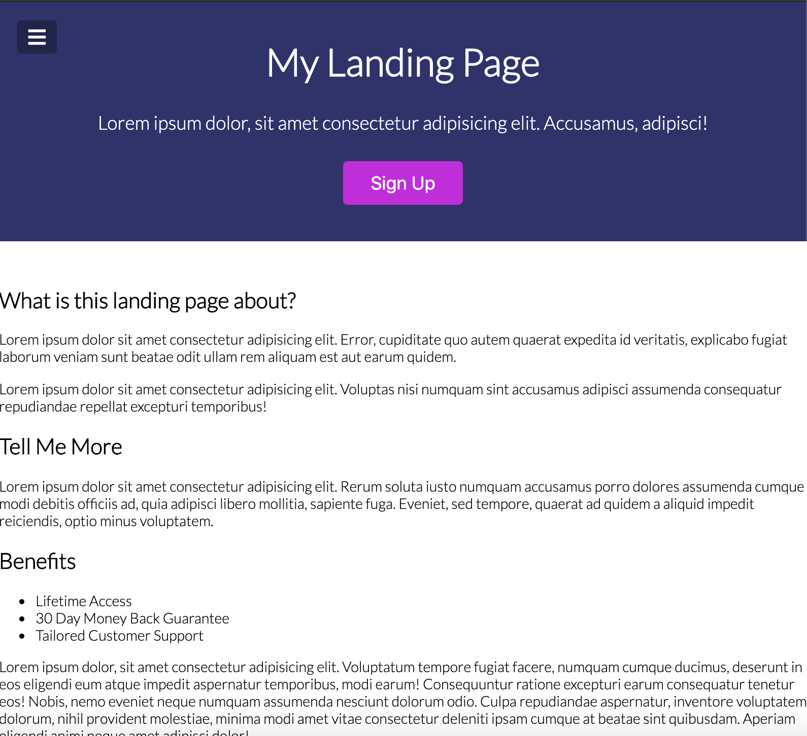
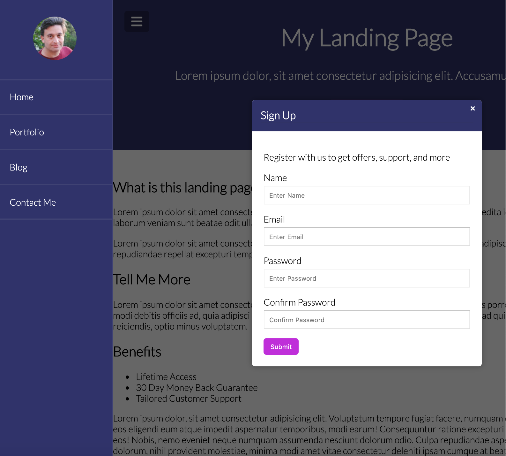

# Modal Menu Slider

This project follows along with the [20 Web Projects With Vanilla JavaScript](https://www.udemy.com/course/web-projects-with-vanilla-javascript/) tutorials by Brad Traversy.

This project creates an informative landing page that includes the following:

- vertical side nav bar that slides into view when nav bar button is clicked, and
- sign up modal that is activated by the sign up button

CSS, JavaScript and HTML are used, as well as a random user image API.

